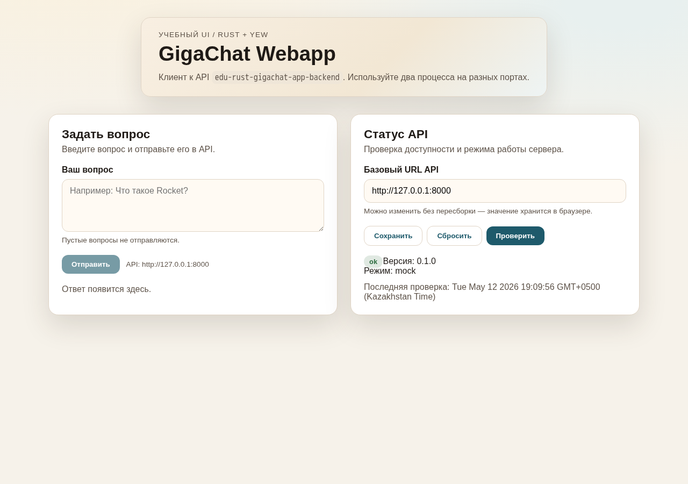
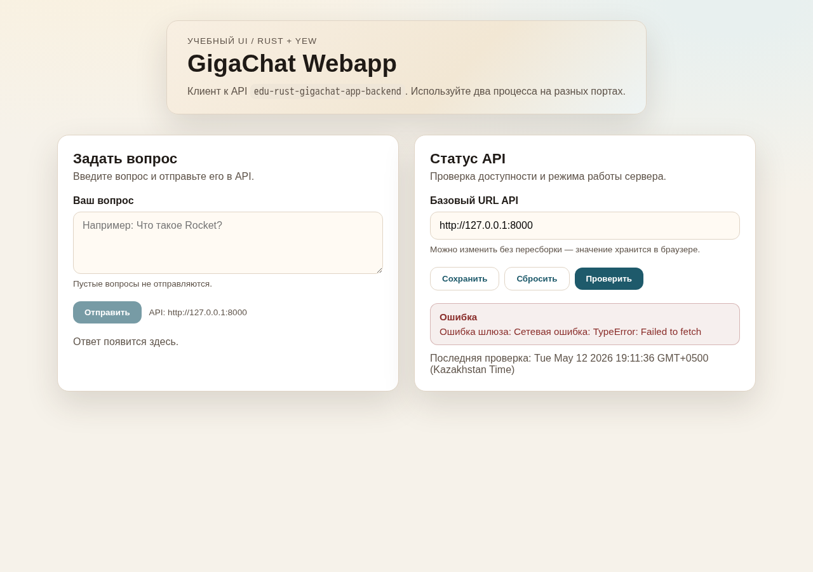
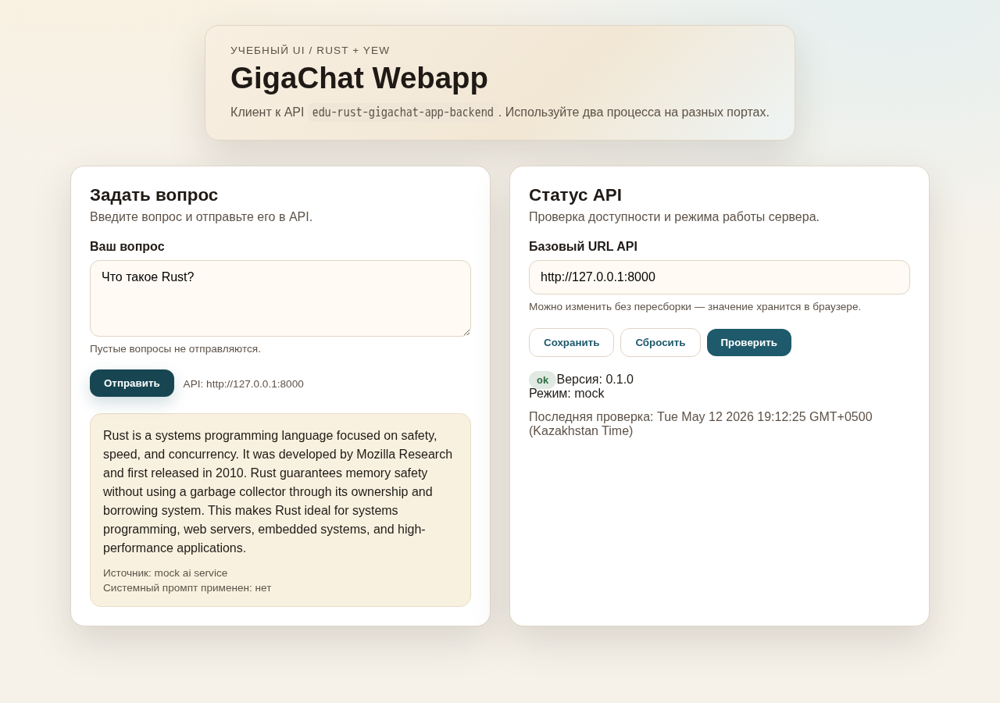

# Отчёт по лабораторной работе №2

**Дисциплина:** Современные технологии программирования
**Тема ЛР:** Подключение учебного UI на Rust (Yew) к backend-API и
устранение типовой проблемы CORS
**Связанный проект:** `edu-rust-gigachat-app-frontend` —
веб-клиент к API `edu-rust-gigachat-app-backend` из ЛР №1

**Студент:** \<ФИО\>
**Группа:** \<группа\>
**Год:** 2026

---

## 1. Цель работы

Освоить подключение веб-клиента на Rust (Yew + Trunk + WebAssembly) к
внешнему REST API, понять механизм same-origin policy и CORS, научиться
диагностировать ошибку «Failed to fetch» и применять корректные
способы её устранения.

## 2. Ожидаемые результаты

После выполнения работы должно быть продемонстрировано:

1. Запуск backend и frontend как двух независимых процессов на разных портах.
2. Проверка доступности API из UI через блок «Статус API».
3. Отправка вопроса через UI и получение ответа от backend.
4. Воспроизведение CORS-проблемы в браузере и её диагностика по консоли разработчика.
5. Применение решения CORS и подтверждение его работоспособности.

## 3. Подготовка окружения

В системе уже установлены `rustup` (stable toolchain), цель компиляции
`wasm32-unknown-unknown` и сборщик `trunk` (0.21+). Backend-проект из
ЛР №1 (`edu-rust-gigachat-app-backend`) находится в соседнем каталоге;
он собирается командой `cargo run` и слушает `http://127.0.0.1:8000`
в mock-режиме.

UI-проект клонируется по инструкции из `docs/build_and_run.md`. Запуск
UI выполняется командой:

```
NO_COLOR=true trunk serve --address 127.0.0.1 --port 8080
```

При первом запуске Trunk также подкачивает соответствующую версию
`wasm-bindgen` CLI.

## 4. Замеченная при подготовке проблема сборки

При первом запуске `trunk build` сборка завершалась ошибкой:

```
error[E0432]: unresolved import `rust_gigachat_webapp`
 --> src/main.rs:6:5
  |
6 | use rust_gigachat_webapp::App;
  |     ^^^^^^^^^^^^^^^^^^^^ use of unresolved module or unlinked crate
```

Имя пакета в `Cargo.toml` — `edu-rust-gigachat-app-frontend`, то есть
автоматически порождённое имя крейта — `edu_rust_gigachat_app_frontend`.
Файл `src/main.rs` при этом ссылался на устаревшее имя
`rust_gigachat_webapp` (которое было у проекта до переименования). Это
несоответствие исправлено одной строкой:

```rust
- use rust_gigachat_webapp::App;
+ use edu_rust_gigachat_app_frontend::App;
```

После правки `trunk build` и `trunk serve` отрабатывают корректно.

## 5. Архитектура UI и взаимодействия с API

UI построен на Yew (функциональные компоненты + хуки), компилируется в
WebAssembly и обращается к backend через HTTP. Внутреннее устройство
кода следует подходу DDD:

```
src/
├── domain/         — сущности и value objects (Question, ApiBaseUrl, ...)
├── application/    — use-cases (AskQuestion, CheckHealth) + порты (ApiPort)
├── infrastructure/ — реализация портов (HTTP-клиент через gloo-net)
├── app.rs          — UI-композиция на Yew
├── config.rs       — конфигурация (default URL + localStorage)
└── main.rs         — монтирование Yew-приложения в #app
```

UI отображает два блока:

- **«Задать вопрос»** — текстовое поле, кнопка «Отправить», область с
  ответом (или ошибкой).
- **«Статус API»** — поле для базового URL API, кнопки
  «Сохранить» / «Сбросить» / «Проверить» и область со статусом сервера
  (зелёная плашка «ok», версия, режим mock/GigaChat).

Базовый URL хранится в `localStorage` (`gloo-storage`) и загружается
при старте; значение по умолчанию — `http://127.0.0.1:8000`.

Сетевые запросы делает HTTP-клиент `infrastructure::ApiClient` через
`gloo-net`. Use-cases `AskQuestionUseCase` и `CheckHealthUseCase`
изолируют UI от деталей транспортного уровня.

## 6. Воспроизведение и устранение CORS-проблемы

### 6.1. Теоретическая основа

Frontend работает на origin `http://127.0.0.1:8080`, backend — на
`http://127.0.0.1:8000`. Порты разные, значит, это два **разных
origin**. По умолчанию браузер запрещает кросс-доменные запросы.
Чтобы они разрешались, сервер должен явно возвращать заголовок
`Access-Control-Allow-Origin`, а для запросов с нестандартным
`Content-Type` (например, `application/json`) — также корректно
отвечать на preflight `OPTIONS`.

### 6.2. Постановка эксперимента

Состояние backend на момент выполнения работы: в `main.rs` уже
реализован CORS-fairing (`struct Cors`), который добавляет заголовки
`Access-Control-Allow-Origin: http://127.0.0.1:8080`,
`Access-Control-Allow-Methods: GET, POST, OPTIONS` и
`Access-Control-Allow-Headers: Content-Type` ко всем ответам. Кроме
того, реализован handler `cors_preflight` для запросов `OPTIONS`.

В такой конфигурации UI работает «из коробки»: блок «Статус API»
автоматически показывает «ok» (см. `screenshots/01-initial.png`),
отправка вопроса через `/ask` возвращает ответ
(`screenshots/02-after-ask.png`).




Это удобно, но для учебной задачи требуется явно воспроизвести проблему.
Для этого CORS-fairing был временно отключён комментированием одной
строки в `src/main.rs` backend-проекта:

```rust
rocket::custom(figment)
    // .attach(Cors)   // временно отключено, чтобы наблюдать CORS-проблему
    .manage(config)
    .manage(ai_service)
```

После пересборки и перезапуска backend UI повёл себя ожидаемо
(см. `screenshots/03-cors-broken.png`):

- В интерфейсе появилось сообщение «Ошибка шлюза: Сетевая ошибка:
  TypeError: Failed to fetch».
- В консоли разработчика браузера зарегистрирована ошибка
  `blocked by CORS policy: No 'Access-Control-Allow-Origin' header
  is present on the requested resource.`
- На вкладке Network запрос `GET /health` отображается как
  `net::ERR_FAILED`.



Это полностью соответствует описанию из раздела 7 учебной методички.

### 6.3. Применённое решение — Вариант A (CORS на backend)

Из трёх возможных подходов (CORS на backend, прокси в Trunk, общий
origin) применён вариант A — настройка CORS на стороне backend. Для
этого строка `.attach(Cors)` возвращена обратно. Соответствующий
fairing определён в `src/main.rs`:

```rust
struct Cors;

#[rocket::async_trait]
impl Fairing for Cors {
    fn info(&self) -> Info {
        Info { name: "Add CORS headers", kind: Kind::Response }
    }

    async fn on_response<'r>(&self, _req: &'r Request<'_>, res: &mut Response<'r>) {
        res.set_header(Header::new(
            "Access-Control-Allow-Origin", "http://127.0.0.1:8080",
        ));
        res.set_header(Header::new(
            "Access-Control-Allow-Methods", "GET, POST, OPTIONS",
        ));
        res.set_header(Header::new(
            "Access-Control-Allow-Headers", "Content-Type",
        ));
    }
}
```

Дополнительно для корректной обработки preflight-запросов в
`handlers/mod.rs` определён handler:

```rust
#[options("/<_path..>")]
pub fn cors_preflight(_path: PathBuf) -> rocket::http::Status {
    rocket::http::Status::NoContent
}
```

После пересборки backend все запросы UI снова проходят без ошибок.

## 7. Проверка результата

Согласно разделу 9 методички, результат считается корректным, если
выполнены четыре условия. По итогам прохождения:

1. **`GET /health` возвращает статус без ошибки CORS** — выполнено.
   В заголовке ответа присутствует
   `Access-Control-Allow-Origin: http://127.0.0.1:8080`.
2. **UI отображает статус сервера и его версию** — выполнено. Блок
   «Статус API» показывает зелёную плашку «ok», «Версия: 0.1.0»,
   «Режим: mock».
3. **`POST /ask` возвращает текст ответа** — выполнено. В ответ на
   вопрос «Что такое Rust?» получен текст mock-описания языка Rust.
4. **В консоли браузера нет сообщений о CORS-блокировке** — выполнено.

Финальное состояние UI после возврата CORS-fairing —
см. `screenshots/04-cors-fixed.png`:



## 8. Ответы на контрольные вопросы (раздел 10 методички)

1. **Что такое origin и почему порты важны?**
   Origin — сочетание схемы, домена и порта (`http://127.0.0.1:8080`).
   Два URL с одинаковыми схемой и доменом, но разными портами,
   считаются разными origin, и браузер по умолчанию запрещает
   передавать между ними данные.

2. **В каких случаях браузер выполняет preflight-запрос?**
   Когда запрос «нестандартный» по правилам simple CORS: метод не
   входит в `GET`/`HEAD`/`POST` с упрощёнными заголовками, либо
   `Content-Type` не `application/x-www-form-urlencoded`,
   `multipart/form-data`, `text/plain`. POST с
   `application/json` относится сюда, и для него отправляется
   предварительный `OPTIONS`.

3. **Какие заголовки должен вернуть сервер, чтобы разрешить CORS?**
   Минимально: `Access-Control-Allow-Origin` (на основной ответ и
   на preflight). Для preflight также: `Access-Control-Allow-Methods`
   и `Access-Control-Allow-Headers` со списком разрешённых методов
   и заголовков.

4. **Чем отличается настройка CORS на сервере от прокси в Trunk?**
   Настройка CORS на сервере — стандартное промышленное решение:
   браузер реально делает запрос cross-origin, сервер явно
   разрешает. Прокси в Trunk — компиляционно-локальный приём: UI
   обращается к relative URL, Trunk-сервер уже сам ходит к backend,
   и в браузере запрос не cross-origin. Подходит только для разработки.

5. **Почему `Access-Control-Allow-Origin: *` нежелателен в реальных системах?**
   Звёздочка разрешает любые источники, включая вредоносные. Для
   приватных API это означает потерю защиты same-origin policy:
   любой сторонний сайт сможет читать ответы от имени пользователя.
   В продакшене лучше указывать конкретный origin или белый список.

## 9. Выводы

В ходе работы получены практические навыки и закреплены концепции:

- Сборка Rust-кода в WebAssembly через Trunk, запуск пары
  «backend на одном порту + UI на другом порту» как стандартная
  локальная конфигурация для разработки.
- Природа ошибки «Failed to fetch» в кросс-доменных запросах и её
  диагностика через консоль разработчика и вкладку Network.
- Конкретные механизмы CORS: основной ответ, preflight-запрос,
  набор заголовков `Access-Control-Allow-*`. Понимание, почему
  CORS реализуется на сервере, а не в клиенте.
- Реализация CORS в Rocket двумя слоями: fairing для добавления
  заголовков ко всем ответам и явный handler для OPTIONS-маршрутов
  любого пути.
- Архитектурная роль use-case-слоя: UI вызывает «бизнес-операцию»
  (`AskQuestionUseCase::execute`) и ничего не знает о деталях HTTP —
  это и упрощает обработку CORS-ошибок (они инкапсулируются на
  уровне use-case как обычные доменные ошибки).

Возможные направления развития:

- Реализовать в Trunk прокси-вариант B как альтернативное решение и
  сравнить, какой подход удобнее для конкретного сценария разработки.
- Перенести список допустимых origin в `config.toml` backend, чтобы
  при изменении порта UI не нужно было пересобирать сервер.
- Добавить визуальное различие в UI между «backend недоступен»
  (сетевая ошибка) и «backend ответил ошибкой» (5xx или валидация)
  — сейчас оба случая показываются как общая «ошибка шлюза».

В целом ЛР2 закрепляет важный принцип: ошибки фронтенда часто
возникают из-за неаккуратной настройки бэкенда, и наоборот, корректно
оформленные заголовки CORS делают взаимодействие двух процессов
прозрачным как для разработчика, так и для пользователя UI.
